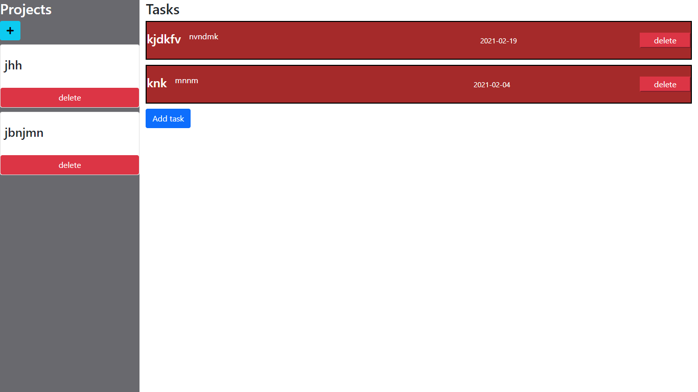

# To-Do List

 

# Demo To do list built for the javascript module.

> The guests can create lists of todos, add/delete and edit todos based on their description/priority/due date/notes and title. The app never does a full refresh of the page and it automatically updates the DOM with every change. It is using `localStorage` for the database.  
> In this project, we were required to build a todo web app using Javascript`s Objects, Factory Functions, and The Module Patterns applying the concepts of Single Responsibility and Tightly Coupled Objects.
> 

## App functionality

- Guests can create lists of todos, add/delete and edit todos based on their description/priority/due date/notes and title.
- The app is currently not mobile responsive.

## This web app is live, you can check it here: [Live demo](https://rickcoyl.github.io/to-do-list/dist/index.html)

## Screenshots of the app.

## Built With

- HTML/CSS
- Javascript/ES6
- Webpack
- Bootstrap

## Prerequisities

To get this project up and running locally, you must clone this repository or download the files and double click on `index.html` found in the `dist` folder.

## Authors

👤 **RICK OBURU**

- Github: [https://github.com/RICKCOYL](https://github.com/RICKCOYL)
- Twitter: [https://twitter.com/rickcoyl](https://twitter.com/rickcoyl)
- Linkedin: [https://www.linkedin.com/in/rick-oburu/](https://www.linkedin.com/in/rick-oburu/)

## 🤝 Contributing

Our favourite contributions are those that help us improve the project, whether with a contribution, an issue, or a feature request!

## Show your support

If you've read this far....give us a ⭐️!

## 📝 License

This project is licensed by Microverse and the Odin Project
